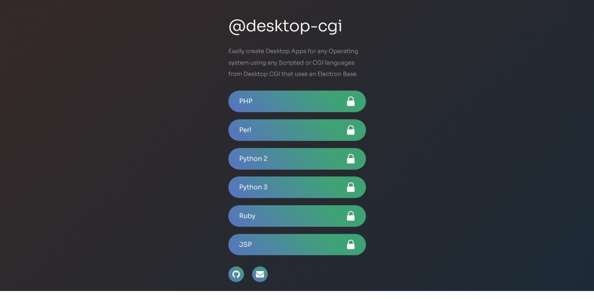

# cgijs
    

*`CGIJS` is a all featured library to run any `CGI` mode / `Interpreted language script` files, or connect to any web application server proxies, or manage processes in the system.*


`CGIJS` library:

- Supports running any `CGI` / `Interpreted Language scripts` in `any OS` that runs `node.js`.
- Supports both `CGI` executables as well as `proxy` to `localhost`/ `remote` /`embedded servers` using proxying of multiple protocols (`http`, `websockets`, `tcp`, `udp`, `socks`, `ssh`, `ftp`).
- Supports managing processes like `embedded` `server` executables, embedded `database` executables, or `any other` embedded/ non-embedded executables 
- Supports working with shell, json, ini, csv, yaml, and xml internally


`[Funding Invited]`


*General Note: The library is production ready. However, please be cautious of processes/executables permissions/security in your project using CGIJS*


# History

CGIJS was created with a motivation to allow creation of a `Desktop executable/ application` using `Electron` that can run any `CGI` / `Interpreted language scripted files/ applications` under the hood. 


[](https://github.com/desktop-cgi/desktop-cgi)


# Installation

```
npm install cgijs --save
```


# Features

*Light weight, Flexible, Generic implementation. CGIJS is Nodejs `Framework Independent / agnostic` for application development.*


There are three main modules inside CGIJS - `file` for CGI file execution, `proxy` for running proxies, and `process` for managing processes.


#### **SECURITY NOTE**:


- The process shell module is security agnostic and is dependant on your code.
    - The package accesses the shell to run script executables using the node.js process module. Please consider your `security risks based on your executable's/ script's security risks`.
- The proxy module is security agnostic and is dependant on your code and proxy's security.
    - The `package has a LAN or WAN network proxy module AND does not create any proxies` by its own - unless specified by you. Please consider your custom created proxy's security risks.
- The `package does not use Telemetry, nor Collect data Remotely, nor has Telemetry/Remote based Error collection` on its own.
    - The package propogates errors for you to handle or collect errors/ data.


# Library Features


##### Node CGI Embedded - run interpreted scripts that support cgi using nodejs

* [x] CGI file execution
    - [x] Run any scripts that support CGI based serving/execution
    - [x] Run multiple CGI executables/ Interpreters in one or multiple applications
    - [x] Embed your own CGI/ Interpreted Language executables


##### Node Web Proxy - run web proxies

* [x] Running Proxies
    - [x] Run any host that serves a web app, using proxy 
    - [x] Run proxies for Application (Local / Remote)
    - [x] Supports websocket implementation in web proxies
    - [x] Run multiple protocol proxies (HTTP, UDP, TCP, Websockets, Socks) and multiple instances in one or multiple applications


##### Node Processes - Manage web servers, database processes, or other system processes or services

* [x] Manage Processes or Services
    - [x] Allows running and closing process Executables
    - [x] Allows managing Embedding Web Servers, which can run web applications through proxies [TODO Testing for some embeddable servers]
    - [x] Allows managing Embedded Database servers [TODO Testing for some embeddable databases]
    - [x] Should run smoothly with Unsupported proxy servers/ processes/ services (not widely tested)
* [x] Embedding
    - [x] Multiple web servers in one or multiple applications
    - [x] Multiple databases in one or multiple applications


# Functionality Details

##### The script should support piping all files of below interpreted languages:

* [x] Python (2.x, 3.x) - `py` (for Python .py extension files. Needed for *nix systems)
* [x] Perl (Version Independent) - `plc`, `pld`, `pl` (for Perl .pl, .plc, .pld extension files)
* [x] PHP (Version Independent) - `php` (for .php extension files)
* [x] Ruby (Version Independent) - `rb` (for Ruby .rb extension files)
* [x] Node.js (Version Independent) - `js` (for Node.js .js extension files)
* [x] CGI - `cgi` (for CGI .cgi extension files) [TODO Testing]

##### The script should support piping all proxies of above languages and following:

* [x] Jsp (With Tomcat, or any webserver as proxy) 
* [x] Aspx (With IIS, Apache, or any webserver as proxy)
* [] Jsp (With Tomcat embedded) [TODO]
* [] Aspx (With Nginx and Apache embedded) [TODO]

##### The script currently allows working with (starting, stopping, restarting) following web servers:

* [x] IIS (Allows Proxy) [Done]
* [x] Nginx (Allows Proxy) [Done]
* [x] Apache HTTPD (Allows Proxy) [Done]
* [x] Apache TomCat (Allows Proxy) [Done]
* [x] Nginx (Allows Embed) [Done]
* [x] Apache HTTPD (Allows Embed) [Done]
* [x] Apache TomCat (Allows Embed) [TODO - Testing, should work based on current testing of other proxies]
* [x] Mongoose (Allows Proxy) [TODO - Testing, should work based on current testing of other proxies]
* [x] Jetty (Allows Proxy) [TODO - Testing, should work based on current testing of other proxies]
* [x] Putty (Allows Proxy) [TODO - Testing, should work based on current testing of other proxies]
* [] Mongoose (Allows Embed) [TODO - Testing]
* [] Jetty (Allows Embed) [TODO - Testing]
* [x] Putty (Allows Embed) [TODO - Testing]
* [x] PHP development server using `php -S` <!-- php -S localhost:8000  -->
* [x] Ruby development server using `rails server` [TODO - Testing] <!-- bin/rails server -->
* [x] Python development server using `py -m http.server` <!-- If Python version returned above is 3.X. On Windows, try "py -m http.server" or "py -3 -m http.server". If Python version returned above is 2.X use SimpleHTTPServer. python3 -m http.server OR python -m SimpleHTTPServer -->
* [x] Other Proxy-able local/remote servers


##### The script currently allows working with (starting, stopping, restarting) following databases and processes:

* [x] Mysql [Done]
* [x] MongoDB [Done]
* [] PgSQL [TODO]
* [] Redis [TODO]
* [x] bash, bat, ps scripts [Done]
* [x] Other Processes for your application support


##### Note:

*This library is in active development. Issues, and feedbacks as github ticket are welcome.*


##### Package Dependencies:

* Environment and Library dependencies:
    - Nodejs: (> 8.x),
    - [http-proxy](https://www.npmjs.com/package/http-proxy),
    - [socks](https://www.npmjs.com/package/socks),
    - [udp-proxy](https://www.npmjs.com/package/udp-proxy),
    - [socket-proxy](https://www.npmjs.com/package/socket-proxy),
    - [http-proxy-to-socks](https://www.npmjs.com/package/http-proxy-to-socks),
    - [csv](https://www.npmjs.com/package/csv) file parser,
    - [xml-js](https://www.npmjs.com/package/xml-js) xml file parser,
    - [yaml](https://www.npmjs.com/package/yaml) yaml file parser,
    - [ini](https://www.npmjs.com/package/ini) ini file parser,
    - [shelljs](https://www.npmjs.com/package/shelljs) to work with shell
    

* Application Dependencies:
    - Your app, you decide
    - Example/Demo has "express": "^4.17.1"
    - Alternatively, Use any other Nodejs framework you want to use for your app


##### Usage Demo:

This project contains example that demonstrates working with ExpressJS.

- The demos for runing CGI/Interpreted scripts with node.js and express applications can be found in the folder [demo app](https://github.com/cgi-js/cgi-js/tree/main/demo/demo-app).
- The demos for individual implementation of file, process, proxy, and utils modules can be found in the folder [demo usage [todo]](https://github.com/cgi-js/cgi-js/tree/main/demo/demo-usage)


##### Use case:

[cgijs](https://www.npmjs.com/package/cgijs) library has been created to address following use cases:
    
- working with CGI / interpreted languages from `any` Node.js app framework
- using any CGI / interpreted languages apps with electron as demonstrated in functioning [desktop-cgi](https://github.com/desktop-cgi/desktop-cgi) app


# Technical Specifications

...  * Wiki links to be added


### Wiki

* Getting started
    - Quick demo - CGI mode executable files
    - Quick demo - proxying to proxies/servers
    - Quick demo - proxying to proxy's websocket
    - Quick demo - proxying to udp, socks, http to socks proxy's websocket
* Run CGI files
    - PHP (.php)
    - Perl (Perl any versions - .plc, .pld, .pl)
    - Python (Python2, Python3 - .py)
    - Ruby (.rb)
    - Node.js (.js)
* Run Proxy servers to connect to:
    - Any Local http/https/websocket Servers
    - Any Remote http/https/websocket Servers
    - Embedded Apache httpd, Apache tomcat, Nginx (http/https/websocket)
    - Embedded Mongoose http server (http/https)
* Manage Embedded Servers (for desktop-cgi use case):
    - Embedded Apache httpd (http/https/websocket)
    - Embedded Apache tomcat (http/https/websocket)
    - Embedded Mongoose http server (http/https)
    - Embedded Nginx (http/https/websocket)
    - PHP inbuilt web development servers
    - Ruby inbuilt web development servers
    - Python inbuilt web development servers
* Manage Embedded Database Servers (for desktop-cgi use case):
    - Embedded Mysql
    - Embedded MongoDB
    - Embedded PgSQL
    - Working with SQLite
* Manage Processes (for desktop-cgi use case):
    - Other Processes or executable workings
* Run and Manage embedded or non-embedded executables / processes on need for application
* Working with config.json file for simpler implementation in apps


# Current Status

* In development [Testing for Desktop-CGI use case]
* In development [Testing for language based development server]


# Todo

Check [.todo](https://github.com/cgi-js/cgi-js/blob/main/.todo) file for latest TODO list

<!-- # References -->


# License

The MIT License (MIT) - See [LICENSE](https://github.com/cgi-js/cgi-js/blob/main/LICENSE) for further details


Copyright © 2019 - till library works:
    Ganesh B <desktopcgi@gmail.com>


#### Please support the development in github repository through 
    - feature needs reporting,
    - testing,
    - issue reporting,
    - contribution
    
Please use these [styles](https://github.com/cgi-js/cgi-js/issues/13) for contributions

